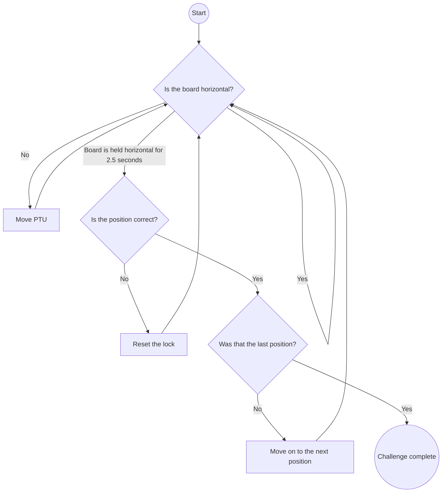

# Git_Commit

Repository for Thursday 9am 'Git_Commit' Major Project MTRX2700

Group Members:
- Richard Gan
- Will Pennell
- Hiroshi Mukhopadhyay
- Quinn Hannam
- Ruchir Bais 

Roles:
- LIDAR (Challenge 1) Hiroshi
- TSC (Challenge 2) Quinn
- Combination Lock (Challenge 3) Richard
- GUI Will

## Modules
- [ADC](#adc)
- [LIDAR](#lidar)
- [TSC](#tsc)
- [Combination Lock](#combination-lock)
- [GUI](#gui)

### ADC

### LIDAR

#### User Instructions

#### Testing Procedures

### TSC

#### User Instructions

#### Testing Procedures

### Combination Lock

#### User Instructions

#### Testing Procedures

#### High Level Flow Chart

### GUI

## Communication Protocols:

### Format
Sentinels -> Mode -> Data -> End of Sequence  
### Modes
Sentinels -> `AA55`  
End of Sequence -> `!`  
Mode = `1` -> Change state  
- Data -> 2 bytes (number for state)  

Mode = `2` -> Challenge completed  
- Data ->  

Mode = `3` -> Notes being played  
- Data -> 6 bytes (1 for each note)  

Mode = `4` -> Board to board TX  
- Data ->   4 bytes 

Mode = `5` -> LIDAR data  
- Data -> 4 bytes for distance 

Mode = `6` -> LIDAR target  
- Data -> 4 bytes for distance 

Mode = `7` -> GYRO data  
- Data ->  

### Integration

#### User Instructions

#### Testing Procedures

## PIN-OUT:
### Master Board:
USB -> USART1  
PA15 -> PWM1 
PA1-> PWM2 
PB7 -> SDA 
PB6 -> SCL 
PA8 -> LASPWM 

### ADC Board
USB -> USART1 
PA0 -> ADC1 (1) 
PA1 -> ADC1 (2) 
PA2 -> ADC1 (3) 

### Touch Board
USB -> USART1 
PA1 -> Group 1 Sample 
PA2 -> Group 1 Channel 
PB0 -> Group 3 Sample 
PB1 -> Group 3 Channel 
PB11 -> Group 6 Channel 
PB12 -> Group 6 Sample 
PA4 -> Group 2 Channel 
PA5 -> Group 2 Sample 
PA9 -> Group 4 Channel 
PA10 -> Group 4 Sample 
PB4 -> Group 5 Sample 
PB6 -> Group 5 Channel 
